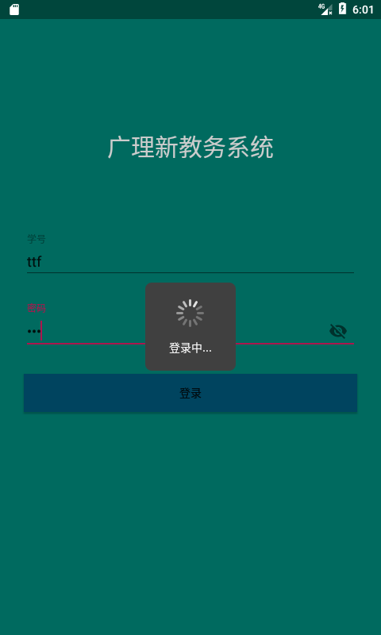

# CustomProgressDialog
A Android CustomProgressDialog used to Logining

==========


* 第一步，自定义DiaLog背景：res/drawable/progress_custom_bg.xml
* First,custom background：res/drawable/progress_custom_bg.xml

* 第二步，res/drawable下spinner_0--11复制到自己项目的相应目录下
* Second,copy res/drawable spinner_0 ...11 in your project the same address

* 第三步, 将12张图片串成帧动画：res/drawable/spinner.xml
* Third,add 12 image into animation-list：res/drawable/spinner.xml

* 第四步,自定义dialog : res/layout/progress_custom.xml
* Fourth,custom dialog : res/layout/progress_custom.xml

* 第五步,添加Dialog style :res/values/styles.xml
* Fifth,add dialog style. :res/values/styles.xml

* 第六步,复制java下的CustomProgress.kt代码在自己项目中
* Sixth,copy java/CustomProgress.kt in your project.

* Activity:

```Kotlin
class MainActivity : AppCompatActivity() {
    private lateinit var customProgress:CustomProgress

    override fun onCreate(savedInstanceState: Bundle?) {
        super.onCreate(savedInstanceState)
        setContentView(R.layout.activity_main)
        button_login.setOnClickListener {
            customProgress = CustomProgress.show(this,"登录中...",true,null)
        }
    }
}
```

